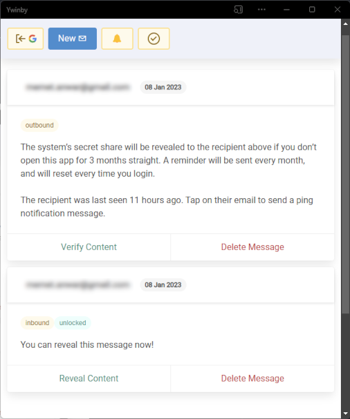

# Ywinby


Ywinby is a simple secret recovery/inheritance system based on Shamir's Secret Sharing.

It uses a 2 out 3 scheme whereby a secret owner splits a secret into 3 parts and holds the 1st share, gives the 2nd share to the would-be recipient, and the last share to Ywinby server. The server will then periodically ping the owner, and will release its share to the recipient if the owner fails to respond after a certain time threshold decided by the owner.

This means:
- The recipient can only recover the message if the owner stops responding for a period of time decided by the owner.
- The owner can cancel the message at anytime by deleting the server's secret share.
- The server never knows the actual secret message.

## Screenshot



## Demo

See [Quick Start](docs/quick-start.md) for a guide on how to setup and run a demo.

## How it works

- Both the secret owner and would-be recipient access the web client, sign in to the API server using Google accounts, and register for web push notification.
- Owner creates a secret message specifying the time period between pings, for instance every 1 month, and the number of consecutive failure to respond allowed, lets say 3 times.
- The web client (a 100% client-side only PWA) splits the secret message into 3 shares. The owner keeps one share for verification purpose, and gives the 2nd share to the recipient through other means (chat, email, etc.). The web client then submit the last share to the API server.
- The API server will then send a web push notification as a reminder to the owner every 1 month, and will release its share to the recipient if the owner fails to respond in 3 months straight. The timer will reset every time the owner logs in to the server.

## Requirements

- Linux OS (bare-metal/VM/container) for the server, with Internet-accessible HTTPS endpoint pointed to the server's 8080/tcp port.

- An HTTPS hosting environment for the web client files, e.g. [Firebase Hosting](https://firebase.google.com/docs/hosting).

- A Google oAuth2 client ID, created from [Google Cloud Console](https://console.cloud.google.com/apis/credentials/oauthclient).

## Deployment

Ywinby doesn't need to be always-on, so the best option for the server part is to use a container environment that can scale down to zero like [Google Cloud Run](https://cloud.google.com/run) or [Azure Container Apps](https://azure.microsoft.com/en-us/products/container-apps/), and use a scheduler like [Github action](https://stackoverflow.com/questions/70176225/github-action-cron-job-first-thursday-of-every-month) to periodically wake the server to perform its checks. The main use case for Ywinby described earlier should comfortably be covered by both Google and Microsoft free-tiers.

A step-by-step guide on how to do this with Cloud Run and Github action is given [here](docs/cloud-run.md).

A note on notifications: these are [web push notifications](https://developer.mozilla.org/en-US/docs/Web/API/Notifications_API/Using_the_Notifications_API), so messages will be sent to the specific browser installed on a specific device that the user registered for notification with (by explicitly clicking/tapping the bell icon). To avoid confusion, users should "install" (or "add to homescreen") the web client PWA on a specific device, and only use that to send/receive Ywinby notifications.

## Development info

Server is an Actix-based Rust app.
```shell
cd server
cargo run -- --help
```
Web client is a Next.js PWA exported app (i.e. Next is only used as React environment with better defaults).
```shell
cd client
npm install
npm run dev
```
See `docker/Dockerfile` and its associated script in `scripts/dockerbuild.sh` for details on how to integrate both projects.

More about design:

- Data (the system's secret shares, schedules, users push registration info) can be stored in JSON files or [Firestore](https://firebase.google.com/docs/firestore). JSON files are stored inside the `db` directory (auto-created), so this should be mounted off a persistent storage.
- Server doesn't maintain any state (users' sessions, etc.) in order to support scaling-to-zero operation mode.
- Secret sharing uses the same implementation as in [here](https://iancoleman.io/shamir/), so users can recover messages without Ywinby.

## What's with the name?

<strong>Y</strong>ou <strong>W</strong>ill <strong>I</strong>nherit <strong>N</strong> <strong>B</strong> happ<strong>Y</strong> is chosen in contrast to [you'll own nothing, and you'll be happy](https://i.kym-cdn.com/photos/images/original/002/313/271/fbd.jpg).
